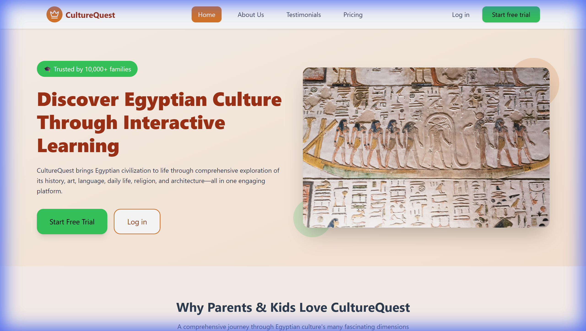
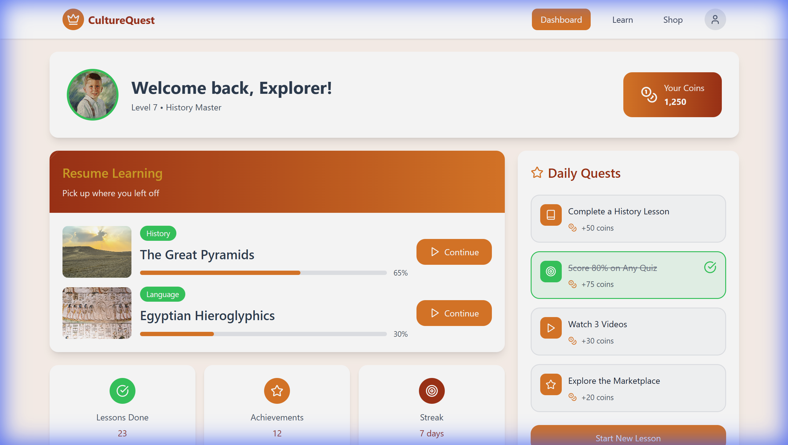
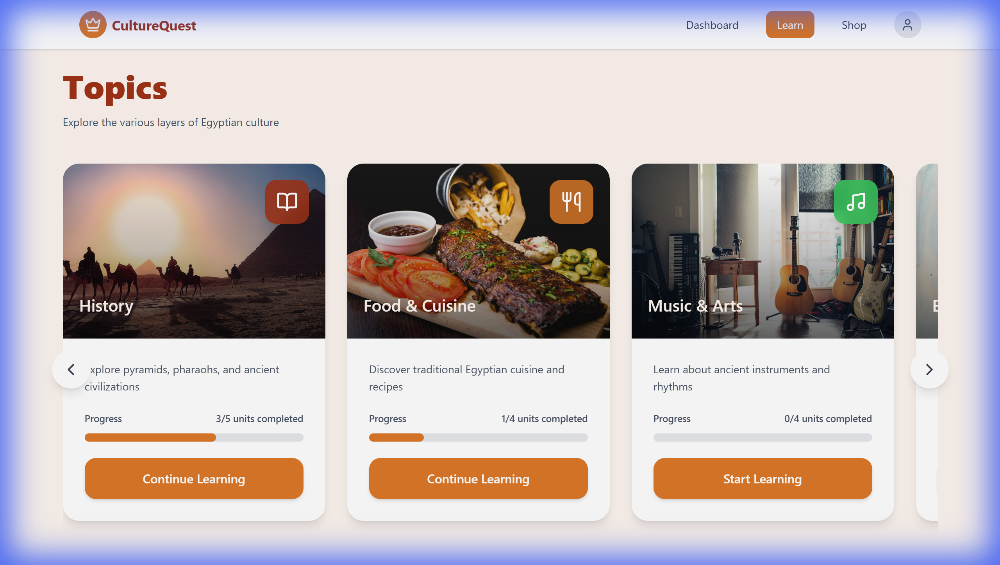
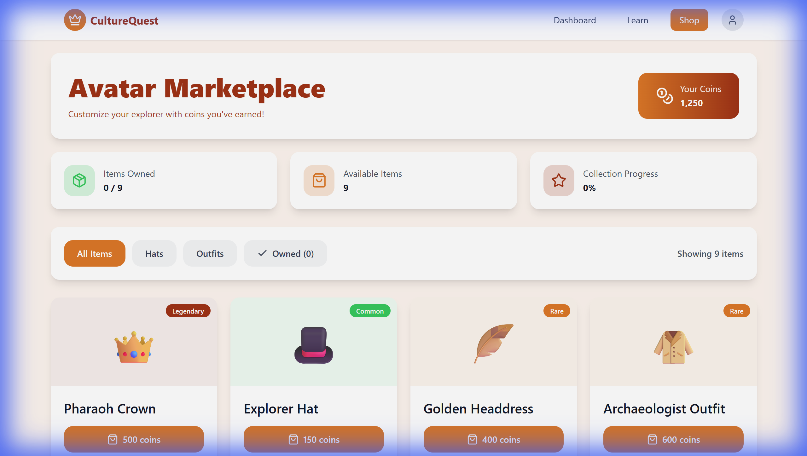
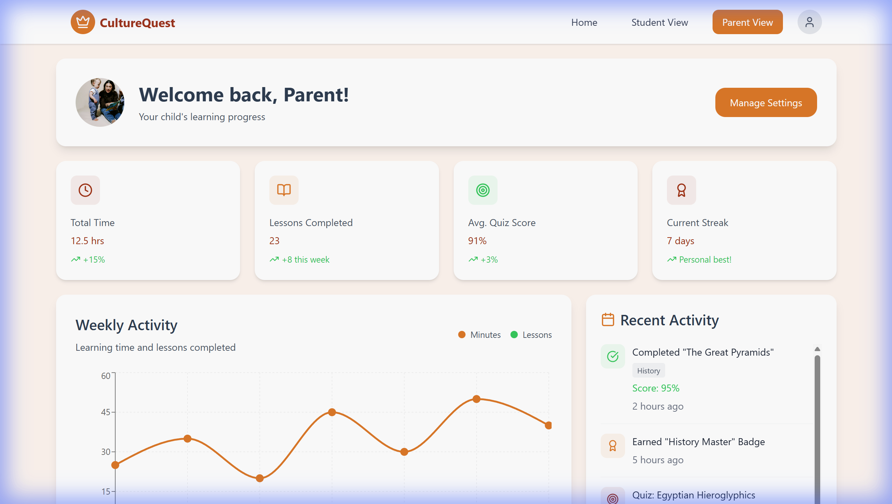
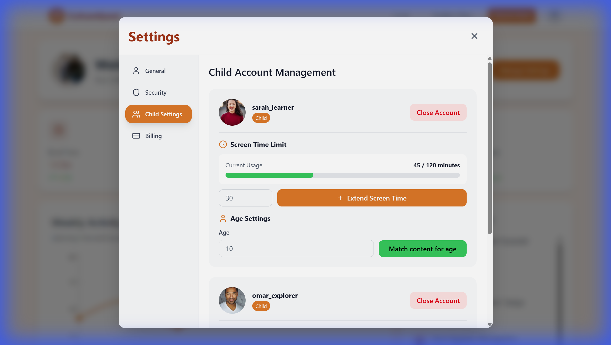

# CultureQuest Website Design

An interactive educational platform designed to teach Egyptian culture through engaging lessons, quizzes, and gamification. This project features both student and parent dashboards with comprehensive parental controls.

## 🌟 Features

### Landing Page with Product Details
The landing page showcases CultureQuest's mission to make learning Egyptian culture fun and accessible for children. It includes product highlights, pricing information, and a clear call-to-action.



### Student Dashboard
An engaging dashboard where students can track their learning progress, view achievements, and access their personalized learning journey through Egyptian culture.



### Curriculum Views with Topics
Explore a rich curriculum covering multiple aspects of Egyptian culture including:
- **History** - Ancient civilizations and pharaohs
- **Food & Cuisine** - Traditional Egyptian dishes
- **Music & Arts** - Cultural expressions and traditions
- **Language** - Arabic language basics
- **Daily Life** - Modern and ancient Egyptian lifestyle
- **Religion** - Beliefs and practices



### Avatar Marketplace
Students can personalize their learning experience by customizing their avatar with Egyptian-themed items like pharaoh crowns, explorer hats, and traditional accessories. Items are purchased using coins earned through learning activities.



### Parent Dashboard with Activity Summary
Parents have access to a comprehensive dashboard showing:
- Child account overview
- Learning progress and achievements
- Activity summaries and time spent
- Quick access to parental controls



### Screen Time Controls & Content-Age Matching
Advanced parental controls allow parents to:
- **Screen Time Management** - Set and extend daily screen time limits with visual progress indicators
- **Age-Based Content Matching** - Automatically adjust content difficulty and appropriateness based on the child's age
- **Account Management** - Manage multiple child accounts from a single parent dashboard



## 🚀 Getting Started

### Prerequisites
- Node.js (v14 or higher)
- npm or yarn

### Installation

1. Clone the repository:
```bash
git clone https://github.com/GasserAli/Culturequestwebsitedesign.git
cd Culturequestwebsitedesign
```

2. Install dependencies:
```bash
npm install
```

3. Start the development server:
```bash
npm run dev
```

4. Open your browser and navigate to:
```
http://localhost:3000
```

## 🛠️ Technology Stack

- **React** - Frontend framework
- **TypeScript** - Type-safe development
- **Vite** - Build tool and development server
- **React Router** - Client-side routing
- **Lucide React** - Icon library
- **Tailwind CSS** - Utility-first CSS framework

## 📁 Project Structure

```
src/
├── components/          # Reusable UI components
│   ├── LandingPage.tsx
│   ├── StudentDashboard.tsx
│   ├── ParentDashboard.tsx
│   ├── Curriculum.tsx
│   ├── Marketplace.tsx
│   ├── SettingsModal.tsx
│   └── ...
├── App.tsx             # Main application component
└── main.tsx            # Application entry point
```


## 📝 Key Features Implementation

### For Students:
- Interactive lessons and quizzes
- Progress tracking and achievements
- Avatar customization
- Gamified learning experience
- Egyptian culture exploration

### For Parents:
- Multiple child account management
- Screen time monitoring and controls
- Age-appropriate content filtering
- Activity summaries and reports
- Secure parental dashboard access
